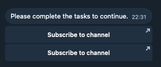

# @telegramium/grammy-channel-verification

Task verification middleware for grammY bots. Verify users have completed required tasks (subscribe to channels, start bots, custom tasks) before accessing your bot.



## Features

- ⭐ Built-in i18n support.
- 🗄️ Built-in caching support.
- 🔷 TypeScript support.

## Install

```bash
npm install @telegramium/grammy-channel-verification
# or
pnpm add @telegramium/grammy-channel-verification
# or
yarn add @telegramium/grammy-channel-verification
```

## Simple Usage

### Example 1: Channel Subscription

```ts
import { Bot } from 'grammy';
import { createVerifier, TaskChecker, ChannelTask } from '@telegramium/grammy-channel-verification';

const bot = new Bot(process.env.BOT_TOKEN);

const verifier = await createVerifier({
    checker: new TaskChecker({
        tasks: [new ChannelTask({ id: -1001234567890 })],
        api: bot.api,
    }),
});

bot.use(verifier);

bot.command('start', async (ctx) => {
    if (!(await ctx.verifyTasks())) {
        return; // User needs to complete tasks
    }
    await ctx.reply('Welcome!');
});

bot.start();
```

### Example 2: Multiple Tasks

```ts
import { Bot, Api } from 'grammy';
import { createVerifier, TaskChecker, ChannelTask, BotTask } from '@telegramium/grammy-channel-verification';

const bot = new Bot(process.env.BOT_TOKEN);

const verifier = await createVerifier({
    checker: new TaskChecker({
        tasks: [
            new ChannelTask({ id: -1001234567890 }),
            new BotTask({
                username: 'my_other_bot',
                api: new Api('1111:xxxx'), // Optional: verify user started the bot
            }),
        ],
        api: bot.api,
    }),
});

bot.use(verifier);

bot.command('premium', async (ctx) => {
    if (!(await ctx.verifyTasks())) {
        return;
    }
    await ctx.reply('Premium access granted!');
});

bot.start();
```

### Example 3: Flyer Service Integration

```ts
import { Bot } from 'grammy';
import { createVerifier, FlyerChecker } from '@telegramium/grammy-channel-verification';

const bot = new Bot(process.env.BOT_TOKEN);

const verifier = await createVerifier({
    checker: new FlyerChecker({
        key: process.env.FLYER_KEY, // Your Flyer service API key
    }),
});

bot.use(verifier);

bot.command('start', async (ctx) => {
    if (!(await ctx.verifyTasks())) {
        return; // Flyer service handles the prompt
    }
    await ctx.reply('Welcome!');
});

bot.start();
```

## Full Documentation

### Basic Setup

```ts
import { Bot, Api } from 'grammy';
import {
    createVerifier,
    TaskChecker,
    ChannelTask,
    BotTask,
    CustomTask,
    FlyerChecker,
    MemoryCache,
} from '@telegramium/grammy-channel-verification';

const bot = new Bot(process.env.BOT_TOKEN!);

// Create verification middleware
const verifier = await createVerifier({
    // TaskChecker handles all task verification
    checker: new TaskChecker({
        // Array of tasks users must complete
        tasks: [
            // Channel task - user must subscribe to channel
            new ChannelTask({
                id: -1001234567890, // Channel ID
                url: 'https://t.me/my_channel', // Optional: invite link (will be resolved if not provided)
                button: (ctx) => 'Custom Button Text', // Optional: custom button label
            }),

            // Bot task - user must start another bot
            new BotTask({
                username: 'my_other_bot', // Bot username without @
                url: 'https://t.me/my_other_bot', // Optional: defaults to https://t.me/{username}
                api: new Api('1111:xxxx'), // Optional: API instance of the bot to check if user started it
                button: (ctx) => 'Start Bot', // Optional: custom button label
            }),

            // Custom task - your own verification logic
            new CustomTask({
                url: 'https://example.com',
                check: async (ctx) => {
                    // Your custom verification logic
                    // Return true if task is completed, false otherwise
                    return await someCustomCheck(ctx.from?.id);
                },
                button: (ctx) => 'Complete Task', // Optional: custom button label
            }),
        ],

        // API instance - used to resolve channel details if not provided
        api: bot.api,

        // Optional: custom prompt handler
        sendPrompt: async (ctx, tasks) => {
            // tasks is an array of Task instances
            // Customize how the prompt is sent
            const keyboard = TaskChecker.generateKeyboard(tasks, ctx);
            await ctx.reply('Please complete the tasks', {
                reply_markup: keyboard,
            });
        },
    }),

    // Optional: cache adapter for performance
    cache: new MemoryCache(), // In-memory cache (single process)
    // or use RedisCache for multi-process setups

    // Optional: cache TTL in seconds (default: 3600)
    cacheTtlSeconds: 1800,

    // Optional: custom cache key function
    cacheKey: (ctx) => (ctx.from ? `verif:${ctx.from.id}` : null),

    // Optional: error handler
    onError: (error, ctx) => {
        console.error('Verification error:', error);
    },

    // Optional: fail open (default: true)
    // If true, allows users through on errors
    failOpen: true,
});

// Apply middleware to bot
bot.use(verifier);
```

### Using Verification

```ts
// In any handler, check if user has completed tasks
bot.command('start', async (ctx) => {
    // verifyTasks() returns true if all tasks completed, false otherwise
    // If false, the prompt is automatically sent
    if (!(await ctx.verifyTasks())) {
        return; // User blocked until tasks completed
    }

    // User has completed all tasks
    await ctx.reply('Welcome!');
});
```

### Handling "I've done tasks" Callback

When using a custom `sendPrompt`, you can add a button for users to re-check their tasks:

```ts
import { getTranslation } from '@telegramium/grammy-channel-verification';

const verifier = await createVerifier({
    checker: new TaskChecker({
        tasks: [new ChannelTask({ id: -100123 })],
        api: bot.api,
        sendPrompt: async (ctx, tasks) => {
            const t = getTranslation(ctx.from?.language_code);
            const keyboard = TaskChecker.generateKeyboard(tasks, ctx);

            // Add "I've done tasks" button
            keyboard.text("I've done tasks ✅", 'c-verif-refresh');

            const text = t.promptText(tasks.length);
            await ctx.reply(text, {
                parse_mode: 'HTML',
                reply_markup: keyboard,
            });
        },
    }),
});

bot.use(verifier);

// Handle the callback button
bot.callbackQuery('c-verif-refresh', async (ctx) => {
    // Re-check tasks
    if (await ctx.verifyTasks()) {
        const t = getTranslation(ctx.from?.language_code);
        await ctx.answerCallbackQuery({ text: 'You are verified ✅' });
        await ctx.deleteMessage().catch(() => undefined);
    } else {
        await ctx.answerCallbackQuery({
            text: 'You have not completed all tasks ❌',
            show_alert: true,
        });
    }
});
```

### Task Types

#### ChannelTask

Verifies user is subscribed to a Telegram channel.

```ts
new ChannelTask({
    id: -1001234567890, // Channel ID (required)
    url: 'https://t.me/my_channel', // Invite link (optional, will be resolved if not provided)
    button: (ctx) => 'Subscribe', // Custom button label (optional)
});
```

#### BotTask

Shows a button to start another bot. Optionally verifies user started it.

```ts
// Just show button (no verification)
new BotTask({
    username: 'my_bot',
    url: 'https://t.me/my_bot', // Optional
});

// Show button and verify user started the bot
new BotTask({
    username: 'my_bot',
    api: bot.api, // API instance of the other bot (uses user ID to check if bot was started)
    button: (ctx) => 'Start Bot', // Optional
});
```

#### CustomTask

Your own verification logic.

```ts
new CustomTask({
    url: 'https://example.com',
    check: async (ctx) => {
        // Return true if task completed, false otherwise
        const userId = ctx.from?.id;
        if (!userId) return false;

        // Your verification logic here
        return await checkUserInDatabase(userId);
    },
    button: (ctx) => 'Complete Task', // Optional
});
```

### Caching

#### Memory Cache (Single Process)

```ts
import { MemoryCache } from '@telegramium/grammy-channel-verification';

const verifier = await createVerifier({
    checker: new TaskChecker({ tasks: [...] }),
    cache: new MemoryCache(),
    cacheTtlSeconds: 1800, // 30 minutes
});
```

#### Redis Cache (Multi-Process)

```ts
import { RedisCache } from '@telegramium/grammy-channel-verification';
import Redis from 'ioredis';

const redis = new Redis(process.env.REDIS_URL);

const verifier = await createVerifier({
    checker: new TaskChecker({ tasks: [...] }),
    cache: new RedisCache(redis),
    cacheTtlSeconds: 3600,
});
```

### Internationalization

The library automatically detects user language and provides translations:

```ts
import { getTranslation, t } from '@telegramium/grammy-channel-verification';

// Get all translations for a language
const translations = getTranslation('ru');

// Get specific translation
const prompt = t('promptText', 'en', 2); // count = 2
const buttonLabel = t('buttonLabelChannel', 'ru');
```

Supported languages: English, Russian, Spanish, German, French, Italian, Portuguese, Arabic, Chinese, Japanese, Korean, Turkish, Ukrainian, Polish, Hindi, Indonesian, Vietnamese, Thai.

### Task Management

```ts
const checker = new TaskChecker({
    tasks: [new ChannelTask({ id: -100123 })],
    api: bot.api,
});

// Get all tasks
const tasks = checker.getTasks();

// Add a task
await checker.addTask(new BotTask({ username: 'my_bot' }));

// Remove a task by URL
checker.removeTask('https://t.me/my_channel');

// Clear all tasks
checker.clearTasks();

// Replace all tasks
await checker.setTasks([new ChannelTask({ id: -100456 }), new BotTask({ username: 'other_bot' })]);
```

### Context Extension

The middleware adds to your context:

```ts
// Check result stored on context
ctx.verification?.ok; // boolean
ctx.verification?.tasks; // Task[] - uncompleted tasks
ctx.verification?.meta; // Record<string, unknown>

// Method to check verification
await ctx.verifyTasks();
```

### TypeScript

The middleware automatically adds verification properties and methods to your context. For TypeScript support, you can use the provided types:

```ts
import type { WithVerificationContext, VerificationFlavor } from '@telegramium/grammy-channel-verification';
import type { Context } from 'grammy';

// Option 1: Use the helper type
type MyContext = WithVerificationContext<Context>;

// Option 2: Manually extend with VerificationFlavor
type MyContext = Context & VerificationFlavor;

// Now ctx has:
// - ctx.verifyTasks(): Promise<boolean> - Check if user completed tasks
// - ctx.verification?: CheckResult - Current verification result
```

**VerificationFlavor** adds the following to your context:

- `verification?: CheckResult` - The current verification result (if available)
- `verifyTasks(): Promise<boolean>` - Method to check if user has completed verification tasks. Returns `true` if verified, `false` if blocked.

### FlyerChecker

Integrates with [Flyer Service](https://flyerservice.io) for advanced verification management. Flyer handles all prompts and verification logic through their API.

```ts
import { FlyerChecker } from '@telegramium/grammy-channel-verification';

const verifier = await createVerifier({
    checker: new FlyerChecker({
        key: process.env.FLYER_KEY, // Required: Your Flyer service API key
        timeoutMs: 15000, // Optional: Request timeout in milliseconds (default: 15000)
        verifyOnInit: true, // Optional: Verify API key on initialization, you want to disable this on serverless platforms (default: true)
        message: {
            // Optional: Customize Flyer prompt message
            rows: 2, // Number of button rows
            text: 'Custom prompt text',
            button_bot: 'Start Bot',
            button_channel: 'Subscribe',
            button_boost: 'Boost Channel',
            button_url: 'Visit Website',
            button_fp: 'Follow Profile',
        },
    }),
});
```

**Important Notes:**

- Flyer service handles its own prompts and UI - no tasks are returned to the middleware
- When `skip === true` from Flyer API, the user is considered verified
- The checker automatically sends user language code to Flyer for localization
- If Flyer API request fails, verification returns `false` (user blocked)

### Custom Checker

You can create your own checker:

```ts
import type { Checker, CheckResult } from '@telegramium/grammy-channel-verification';

class MyChecker implements Checker {
    async check(ctx: Context): Promise<CheckResult> {
        const ok = await myVerificationLogic(ctx.from?.id);
        return { ok };
    }
}

const verifier = await createVerifier({
    checker: new MyChecker(),
});
```

## API Reference

### `createVerifier(options)`

Creates verification middleware.

**Options:**

- `checker` (required): Checker instance
- `cache?`: CacheAdapter instance
- `cacheTtlSeconds?`: number (default: 3600)
- `cacheKey?`: (ctx) => string | null
- `onError?`: (error, ctx) => void
- `failOpen?`: boolean (default: true)

### `TaskChecker`

Main task checker class.

**Constructor:**

- `tasks`: Task[]
- `api?`: Api
- `sendPrompt?`: (ctx, tasks) => void | Promise<void>

**Methods:**

- `getTasks()`: ReadonlyArray<Task>
- `addTask(task)`: Promise<void>
- `removeTask(url)`: boolean
- `clearTasks()`: void
- `setTasks(tasks)`: Promise<void>
- `generateKeyboard(tasks, ctx)`: InlineKeyboard (static)

### `ChannelTask`

**Constructor:**

- `id`: number | string
- `url?`: string
- `button?`: (ctx) => string

### `BotTask`

**Constructor:**

- `username`: string
- `url?`: string
- `api?`: Api
- `button?`: (ctx) => string

### `CustomTask`

**Constructor:**

- `url`: string
- `check`: (ctx) => Promise<boolean>
- `button?`: (ctx) => string

### `FlyerChecker`

Integrates with Flyer Service API for verification.

**Constructor:**

- `key`: string (required) - Your Flyer service API key
- `timeoutMs?`: number (default: 15000) - Request timeout in milliseconds
- `verifyOnInit?`: boolean (default: true) - Verify API key on initialization
- `message?`: object - Customize Flyer prompt message
    - `rows?`: number - Number of button rows
    - `text?`: string - Custom prompt text
    - `button_bot?`: string - Bot button label
    - `button_channel?`: string - Channel button label
    - `button_boost?`: string - Boost button label
    - `button_url?`: string - URL button label
    - `button_fp?`: string - Follow profile button label

**Methods:**

- `init()`: Promise<void> - Initializes and verifies the API key (called automatically)
- `check(ctx)`: Promise<CheckResult> - Checks user verification status via Flyer API

## License

MIT
